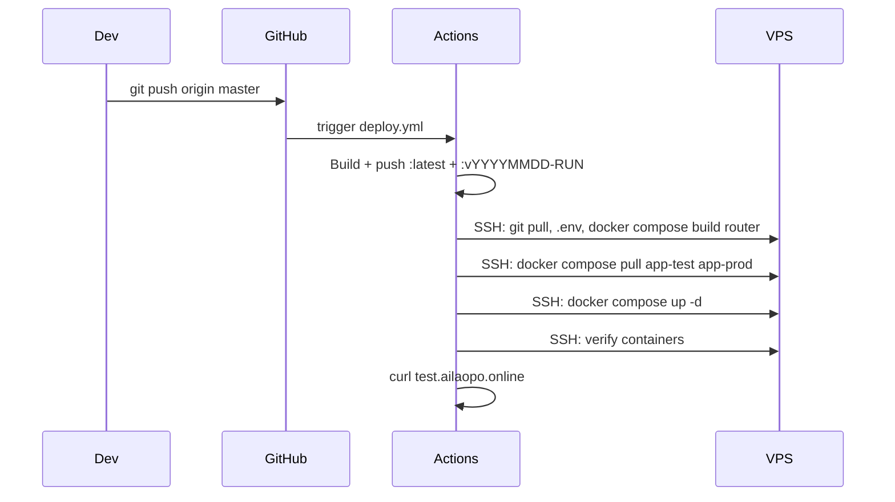

# Deployment Architecture

> Actual deployed infrastructure. All components run inside Docker containers on a single Azure VPS.

---

## 1. Overview

```
                      Internet
                          |
                 ┌────────┴────────┐
                 ▼                 ▼
       test.ailaopo.online    ailaopo.online
           (HTTP:80)         (HTTPS:443)
                 |                 |
                 └────────┬────────┘
                          ▼
        ┌─────────────────────────────────────────┐
        │   Azure VPS (Ubuntu 24.04)              │
        │   Ports open: 80, 443                   │
        │                                         │
        │   ┌─────────────────────────────────┐   │
        │   │  docker compose (4 services)     │   │
        │   │                                 │   │
        │   │  ┌──────────┐                   │   │
        │   │  │  router   │── nginx:alpine   │   │
        │   │  │  :80, :443│   reverse proxy  │   │
        │   │  └────┬─────┘                   │   │
        │   │    ├────┴────┐                  │   │
        │   │    ▼         ▼                  │   │
        │   │  app-test   app-prod            │   │
        │   │  :3000      :3000               │   │
        │   │  :latest    :${PROD_VERSION}    │   │
        │   │    │         │                  │   │
        │   │    └────┬────┘                  │   │
        │   │         ▼                       │   │
        │   │  ┌──────────────┐               │   │
        │   │  │  db          │               │   │
        │   │  │  PostgreSQL  │               │   │
        │   │  └──────────────┘               │   │
        │   └─────────────────────────────────┘   │
        └─────────────────────────────────────────┘
```

### Key Facts

| Aspect | Detail |
|--------|--------|
| **Containers** | 4: `router`, `app-test`, `app-prod`, `db` |
| **VPS** | Azure Ubuntu 24.04, 1 public IP |
| **Firewall** | Only ports 80 and 443 open |
| **Reboot** | Daily 03:00 UTC+8, `restart: unless-stopped` handles it |
| **App Image** | `brodyzhang2026/pier` on Docker Hub (public) |
| **Router Image** | Built locally from `Dockerfile.router` (nginx:alpine) |
| **Deploy** | CI/CD via GitHub Actions |

---

## 2. Services

### router (nginx:alpine)

Routes traffic by domain name:

| Domain | Destination |
|--------|-------------|
| `test.ailaopo.online:80` | `app-test:3000` (via Docker network) |
| `ailaopo.online:80` | 301 redirect → HTTPS |
| `ailaopo.online:443` | SSL terminate → `app-prod:3000` |

- SSL certs mounted from host `/etc/letsencrypt` (read-only)
- No Node.js, no dynamic config — pure nginx

### app-test (Node.js 20)

- **Image**: `brodyzhang2026/pier:latest` (always the most recent push)
- **Purpose**: Test new deployments before promoting to production
- No `ADMIN_EMAIL` env — test can run without admin seed
- Separate volume `agent-data-test` for uploaded files

### app-prod (Node.js 20)

- **Image**: `brodyzhang2026/pier:${PROD_VERSION:-latest}` (pinned version)
- **Purpose**: Stable production serving real users
- Has `ADMIN_EMAIL` for admin user seeding
- Separate volume `agent-data-prod` for uploaded files

### db (PostgreSQL 16)

- Shared database for both test and production
- Health check with `pg_isready` before app containers start

---

## 3. Version Management

**Key concept:** test always runs `:latest`, production runs a specific tag.

### Workflow

```
Git push → build → push :latest + :v20260517-42 to Docker Hub
         → deploy.yml pulls :latest for app-test
         → app-prod keeps running its pinned version
         → test on test.ailaopo.online
         → if passed → update PROD_VERSION → restart app-prod
```

### Promoting to Production

Set the `PROD_VERSION` GitHub variable to a specific version tag (e.g. `v20260517-00000042`):

```bash
# Option 1: Via GitHub UI
# Settings → Variables and secrets → Actions → PROD_VERSION

# Option 2: Via SSH (manual)
cd ~/pier
# Edit .env: PROD_VERSION=v20260517-00000042
docker compose pull app-prod
docker compose up -d app-prod

# Option 3: Trigger promotion workflow (future)
```

Default: `PROD_VERSION=latest` (both test and prod run same version).

---

## 4. Request Flow

### Production Domain (https://ailaopo.online)

```
Browser → https://ailaopo.online:443
  ↓ VPS firewall → container router:443
  ↓ nginx SSL terminate (/etc/letsencrypt)
  ↓ proxy_pass http://app-prod:3000
  ↓ app-prod (Node.js) renders response
```

HTTP redirect:
```
Browser → http://ailaopo.online:80
  ↓ nginx → return 301 https://$host$request_uri
```

### Test Domain (http://test.ailaopo.online)

```
Browser → http://test.ailaopo.online:80
  ↓ nginx → proxy_pass http://app-test:3000
  ↓ app-test (Node.js) renders response
```

No SSL, no redirect for test domain.

---

## 5. Docker Compose

Full configuration at `docker-compose.yml:1-68` — 4 services + 3 volumes.

```yaml
services:
  router:
    build:
      context: .
      dockerfile: Dockerfile.router
    ports: ["80:80", "443:443"]
    volumes: ["/etc/letsencrypt:/etc/letsencrypt:ro"]
    depends_on: [app-test, app-prod]

  app-test:
    image: brodyzhang2026/pier:latest
    volumes: ["agent-data-test:/app/data"]
    depends_on:
      db: { condition: service_healthy }

  app-prod:
    image: brodyzhang2026/pier:${PROD_VERSION:-latest}
    volumes: ["agent-data-prod:/app/data"]
    environment: [ADMIN_EMAIL=${ADMIN_EMAIL}]
    depends_on:
      db: { condition: service_healthy }

  db:
    image: postgres:16-alpine
    volumes: ["pg-data:/var/lib/postgresql/data"]

volumes:
  pg-data:
  agent-data-test:
  agent-data-prod:
```

---

## 6. Image Build

### App Image (`Dockerfile`)

Two-stage build — pure Node.js (no nginx):

| Stage | Base | Steps |
|-------|------|-------|
| builder | `node:20-alpine` | `npm install` → `tsc` → `/app/dist` |
| runtime | `node:20-alpine` | `mkdir /app/data/agents` → copy `dist/`, `views/` → `CMD ["node", "dist/server.js"]` |

- Exposes port 3000 (internal only, not exposed to host)
- No nginx, no entrypoint.sh
- Data directory created at build time

### Router Image (`Dockerfile.router`)

```dockerfile
FROM nginx:alpine
COPY nginx/router.conf /etc/nginx/conf.d/default.conf
EXPOSE 80 443
```

- Built locally on VPS during deploy (`docker compose build router`)
- Router config baked in, no runtime modification needed

---

## 7. CI/CD Pipeline

Trigger: every push to `master`.



### Deploy Steps

1. `git pull origin master` — updates docker-compose.yml, router config
2. Write `.env` — `SESSION_SECRET`, `SENDGRID_API_KEY`, `ADMIN_EMAIL`, `PROD_VERSION`
3. `docker compose build router` — rebuilds nginx from `Dockerfile.router`
4. `docker compose pull app-test` — pulls `:latest`
5. `docker compose pull app-prod` — pulls `${PROD_VERSION}` tag
6. `docker compose up -d` — starts/restarts all services
7. Verify — check `docker compose ps`, container logs
8. Smoke test — curl `http://test.ailaopo.online/`

---

## 8. Environment & Secrets

| Variable | Source | Used By |
|----------|--------|---------|
| `DATABASE_URL` | docker-compose.yml | app-test, app-prod |
| `SESSION_SECRET` | GitHub secret → VPS .env → container | app-test, app-prod |
| `SENDGRID_API_KEY` | GitHub secret → VPS .env → container | app-test, app-prod |
| `ADMIN_EMAIL` | GitHub secret → VPS .env → container | app-prod only |
| `NODE_ENV=production` | docker-compose.yml | app-test, app-prod |
| `PROD_VERSION` | GitHub variable → VPS .env | app-prod image tag |

**Examples:**

```bash
# VPS .env
SESSION_SECRET=<random>
SENDGRID_API_KEY=<key>
ADMIN_EMAIL=admin@example.com
PROD_VERSION=v20260517-00000042
```

---

## 9. Volumes & Persistence

| Volume | Mount | Used By |
|--------|-------|---------|
| `pg-data` | `/var/lib/postgresql/data` | db (PostgreSQL) |
| `agent-data-test` | `/app/data` | app-test |
| `agent-data-prod` | `/app/data` | app-prod |
| Host: `/etc/letsencrypt` | `/etc/letsencrypt:ro` | router |

Test and prod have **separate volumes** — uploaded agent HTML files don't mix.

---

## 10. Startup Sequence

1. Docker Compose creates internal network
2. `pier-db-1` starts, runs `pg_isready` health check
3. `pier-app-test-1` + `pier-app-prod-1` wait for DB health
4. `pier-router-1` starts (no dependency on DB, nginx only)
5. Each Node.js app runs `initDB()` — schema + admin seed (prod only)
6. Router proxies: `test.ailaopo.online` → `app-test`, `ailaopo.online` → `app-prod`

---

## 11. Everything Runs Inside Docker

**Never install anything on the VPS host directly.**

| Component | Container | Managed By |
|-----------|-----------|------------|
| nginx (reverse proxy) | `pier-router-1` | `Dockerfile.router` |
| Node.js (test) | `pier-app-test-1` | `Dockerfile` → Docker Hub image |
| Node.js (prod) | `pier-app-prod-1` | `Dockerfile` → Docker Hub image |
| PostgreSQL | `pier-db-1` | `postgres:16-alpine` |

**VPS host has only:**
- Docker Engine + docker-compose plugin
- SSH server (for CI/CD deploy)
- Let's Encrypt SSL certs at `/etc/letsencrypt`
- The `~/pier` directory (git clone for docker-compose.yml, .env, router config)

**Debugging:**
```bash
sudo docker compose ps                          # All services
sudo docker logs pier-app-test-1 --tail 20      # Test app logs
sudo docker logs pier-app-prod-1 --tail 20      # Prod app logs
sudo docker logs pier-router-1                  # Router/nginx logs
sudo docker exec -it pier-app-test-1 sh         # Shell inside test container
```

---

## 12. Key Files Reference

| File | Purpose |
|------|---------|
| `docker-compose.yml` | 4-service orchestration (router, app-test, app-prod, db) |
| `Dockerfile` | Two-stage Node.js image build |
| `Dockerfile.router` | nginx:alpine image for routing |
| `nginx/router.conf` | nginx config — 3 server blocks routing test/prod |
| `.github/workflows/deploy.yml` | CI/CD pipeline definition |
| `app/src/server.ts` | Express entry point (port 3000) |
| `app/src/services/db.ts` | Database pool + schema init + admin seed |
