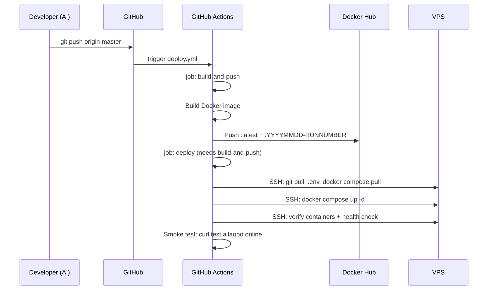

# Deployment Architecture

> Actual deployed architecture. All infrastructure runs inside Docker containers on a single Azure VPS.

---

## 1. Overview

```
                      Internet
                          |
                 ┌────────┴────────┐
                 ▼                 ▼
       test.ailaopo.online    ailaopo.online
           (HTTP:80)         (HTTPS:443)
                 |                 |
                 ▼                 ▼
        ┌──────────────────────────────────┐
        │   Azure VPS (Ubuntu 24.04)       │
        │   Ports open: 80, 443            │
        │                                  │
        │   ┌──────────────────────────┐   │
        │   │  docker compose           │   │
        │   │                          │   │
        │   │  ┌──────────────────┐    │   │
        │   │  │  pier-app-1      │    │   │
        │   │  │  ┌──────────┐    │    │   │
        │   │  │  │  nginx    │◄──┼────┤   │
        │   │  │  │  (80,443) │    │    │   │
        │   │  │  └────┬─────┘    │    │   │
        │   │  │       │          │    │   │
        │   │  │  ┌────▼─────┐   │    │   │
        │   │  │  │  Node.js  │   │    │   │
        │   │  │  │  (:3000)  │   │    │   │
        │   │  │  └──────────┘   │    │   │
        │   │  └──────────────────┘    │   │
        │   │                          │   │
        │   │  ┌──────────────────┐    │   │
        │   │  │  pier-db-1       │    │   │
        │   │  │  PostgreSQL 16   │    │   │
        │   │  │  (:5432)         │    │   │
        │   │  └──────────────────┘    │   │
        │   └──────────────────────────┘   │
        └──────────────────────────────────┘
```

### Key Facts

| Aspect | Detail |
|--------|--------|
| **Containers** | 2: `pier-app-1` (nginx + Node.js), `pier-db-1` (PostgreSQL 16) |
| **VPS** | Azure Ubuntu 24.04, 1 public IP |
| **Firewall** | Only ports 80 and 443 open |
| **Reboot** | Daily 03:00 UTC+8, containers restart via `restart: unless-stopped` |
| **Image** | `brodyzhang2026/pier` on Docker Hub (public) |
| **Deploy** | CI/CD via GitHub Actions (push to master → build → deploy) |

---

## 2. Container Topology

### pier-app-1 (Application Container)

Two processes inside a single container, managed by `entrypoint.sh`:

```
entrypoint.sh
  ├── mkdir -p /var/www/html /app/data/agents
  ├── [optional] rewrite nginx config if no SSL certs
  ├── node dist/server.js &    ← background: Node.js on port 3000
  └── nginx -g "daemon off;"  ← foreground: reverse proxy on ports 80, 443
```

- **nginx**: reverse proxy, SSL termination, routes requests to localhost:3000
- **Node.js**: Express web server, serves EJS views, handles auth/CRUD
- Both communicate internally via `127.0.0.1:3000`

### pier-db-1 (Database Container)

- **Image**: `postgres:16-alpine`
- **No host network exposure** — only accessible internally via Docker network
- **Healthy check**: `pg_isready -U pier` every 5 seconds
- App container waits for healthy DB before starting (`depends_on` + `condition: service_healthy`)

### Docker Compose

```yaml
services:
  app:
    image: brodyzhang2026/pier:latest
    ports:
      - "80:80"
      - "443:443"
    volumes:
      - /etc/letsencrypt:/etc/letsencrypt:ro
      - agent-data:/app/data
    environment:
      - DATABASE_URL=postgres://pier:pier@db:5432/pier
      - SESSION_SECRET=${SESSION_SECRET}
      - SENDGRID_API_KEY=${SENDGRID_API_KEY}
      - ADMIN_EMAIL=${ADMIN_EMAIL}
      - NODE_ENV=production
    depends_on:
      db:
        condition: service_healthy
    restart: unless-stopped

  db:
    image: postgres:16-alpine
    volumes:
      - pg-data:/var/lib/postgresql/data
    environment:
      POSTGRES_USER: pier
      POSTGRES_PASSWORD: pier
      POSTGRES_DB: pier
    healthcheck:
      test: ["CMD-SHELL", "pg_isready -U pier"]
      interval: 5s
      timeout: 5s
      retries: 5
    restart: unless-stopped

volumes:
  pg-data:
  agent-data:
```

---

## 3. Request Flow

### Production Domain (ailaopo.online)

```
Browser → https://ailaopo.online
  ↓ DNS resolves to VPS IP
  ↓ VPS firewall accepts on 443
  ↓ Container port 443 → nginx
  ↓ nginx terminates SSL (/etc/letsencrypt certs)
  ↓ proxy_pass http://127.0.0.1:3000
  ↓ Node.js renders EJS → response back through nginx
```

HTTP (80) for ailaopo.online redirects to HTTPS (301):

```
Browser → http://ailaopo.online
  ↓ nginx server block 1 (port 80, server_name ailaopo.online)
  ↓ return 301 https://$host$request_uri
```

### Test Domain (test.ailaopo.online)

```
Browser → http://test.ailaopo.online
  ↓ DNS resolves to same VPS IP
  ↓ VPS firewall accepts on 80
  ↓ Container port 80 → nginx
  ↓ nginx matches server block 2 (port 80, server_name test.ailaopo.online)
  ↓ proxy_pass http://127.0.0.1:3000 (no SSL, no redirect)
  ↓ Node.js renders EJS → response back
```

No SSL for test domain — HTTP only. No `/.well-known/acme-challenge/` route (not needed).

### nginx Configuration (3 Server Blocks)

| # | Port | server_name | Purpose |
|---|------|-------------|---------|
| 1 | 80 | ailaopo.online, www.ailaopo.online | HTTP → HTTPS redirect + ACME challenge |
| 2 | 80 | test.ailaopo.online | Direct proxy to Node.js (no SSL) |
| 3 | 443 | ailaopo.online, www.ailaopo.online | SSL termination + proxy to Node.js |

Full config at `nginx/nginx.conf:1-53`.

### Dynamic Config Fallback

In `entrypoint.sh`, if Let's Encrypt certs are missing (first deploy / new domain), nginx config is rewritten to HTTP-only for all domains — needed for initial `certbot` setup.

---

## 4. CI/CD Pipeline

Trigger: every push to `master` branch.



### Deploy Steps (SSH Script)

Executed via `appleboy/ssh-action@v1.0.0`:

1. **Clone/Update repo** — `git pull origin master` in `~/pier`
2. **Write .env** — injects `SESSION_SECRET`, `SENDGRID_API_KEY`, `ADMIN_EMAIL`
3. **Stop old containers** — `docker stop/rm pier-app-1 pier-db-1` (frees ports 80, 443)
4. **Docker login** — authenticates to Docker Hub
5. **Pull new image** — `docker compose pull` (gets `brodyzhang2026/pier:latest`)
6. **Start** — `docker compose up -d` (uses pulled image, respects `depends_on` health check)
7. **Verify** — `docker compose ps`, curl internal health endpoints
8. **Smoke test** — curl `http://test.ailaopo.online/`

Workflow at `.github/workflows/deploy.yml:1-110`.

---

## 5. Image Build

Dockerfile (`Dockerfile:1-20`) — two-stage build:

**Stage 1 — builder (node:20-alpine):**
```
npm install → tsc compile → /app/dist
```

**Stage 2 — runtime (node:20-alpine + nginx):**
```
apk add nginx
COPY dist/ views/ nginx.conf entrypoint.sh
EXPOSE 80 443
ENTRYPOINT ["/entrypoint.sh"]
```

**Key points:**
- nginx is installed inside the app container (`apk add nginx`), NOT on VPS host
- nginx.conf is baked into the image at build time (static config), but can be overridden at runtime by entrypoint.sh
- All TypeScript is compiled to JS at build time — no runtime compilation

---

## 6. Environment & Secrets

| Variable | Source | Purpose |
|----------|--------|---------|
| `DATABASE_URL` | docker-compose.yml (hardcoded) | PostgreSQL connection string |
| `SESSION_SECRET` | GitHub secret → VPS .env → container | Encrypts session cookies |
| `SENDGRID_API_KEY` | GitHub secret → VPS .env → container | SendGrid email API (optional, dev fallback) |
| `ADMIN_EMAIL` | GitHub secret → VPS .env → container | Seeds first admin user on DB init |
| `NODE_ENV` | docker-compose.yml (`production`) | Express production mode |

**Flow:** GitHub Secrets → deploy.yml SSH script writes `.env` → docker-compose reads `.env` → container receives env vars.

---

## 7. Volumes & Persistence

| Volume | Mount | Contents |
|--------|-------|----------|
| `pg-data` | `/var/lib/postgresql/data` | PostgreSQL database files |
| `agent-data` | `/app/data` | Uploaded agent HTML files |
| Host bind: `/etc/letsencrypt` | `/etc/letsencrypt:ro` | SSL certificates (read-only) |

Volumes survive container restarts and image updates. Host SSL certs are mounted read-only — container cannot modify them.

---

## 8. Database Connection

Node.js connects to PostgreSQL using `DATABASE_URL`:

```
postgres://pier:pier@db:5432/pier
```

- Hostname `db` resolves via Docker Compose internal network to `pier-db-1`
- No host port mapping for PostgreSQL (not exposed outside Docker network)
- Connection uses `pg.Pool` with `connectionString` (see `app/src/services/db.ts:3-19`)

---

## 9. Startup Sequence

1. Docker Compose creates Docker network
2. `pier-db-1` starts, runs health check (`pg_isready`)
3. `pier-app-1` waits for DB health check (`depends_on.condition: service_healthy`)
4. `entrypoint.sh` runs inside `pier-app-1`:
   - Creates directories
   - Checks SSL certs, optionally rewrites nginx config
   - Starts `node dist/server.js` in background
   - Starts `nginx -g "daemon off;"` in foreground
5. Node.js `initDB()` runs schema creation + admin seed
6. App is ready — nginx proxies requests to localhost:3000

If Node.js crashes, the container still runs (nginx stays up) — user sees nginx error. Hosting process in background means only `set -e` failures cause full container restart.

---

## 10. Domain & DNS

| Domain | Type | Target |
|--------|------|--------|
| `ailaopo.online` | A record | VPS IP |
| `www.ailaopo.online` | CNAME | ailaopo.online |
| `test.ailaopo.online` | A record | VPS IP |

- `ailaopo.online` + `www.ailaopo.online`: SSL via Let's Encrypt (ports 80 + 443)
- `test.ailaopo.online`: HTTP only, no SSL (port 80 only)
- SSL certs stored at `/etc/letsencrypt/live/ailaopo.online/` on VPS host

---

## 11. Everything Runs Inside Docker

**Never install anything on the VPS host directly.**

| Component | Location | Managed By |
|-----------|----------|------------|
| nginx (reverse proxy) | `pier-app-1` | `apk add nginx` in Dockerfile, started by entrypoint.sh |
| Node.js (Express) | `pier-app-1` | `node dist/server.js` started by entrypoint.sh |
| PostgreSQL | `pier-db-1` | `postgres:16-alpine` image |
| User HTML agents | `pier-app-1:/app/data/agents/` | Docker volume `agent-data` |

**VPS host has only:**
- Docker Engine + docker-compose plugin
- SSH server (for CI/CD deploy)
- Let's Encrypt SSL certs at `/etc/letsencrypt`
- The `~/pier` directory (git clone for docker-compose.yml and .env)

**All debugging:**
```bash
sudo docker logs pier-app-1     # View app logs
sudo docker exec -it pier-app-1 sh   # Interactive shell inside container
sudo docker compose ps           # Container status
```

---

## 12. Key Files Reference

| File | Purpose |
|------|---------|
| `docker-compose.yml` | 2-service orchestration (app + db) |
| `Dockerfile` | Two-stage image build (TypeScript → nginx + Node) |
| `entrypoint.sh` | Container startup script (nginx + Node.js) |
| `nginx/nginx.conf` | nginx reverse proxy config (3 server blocks) |
| `.github/workflows/deploy.yml` | CI/CD pipeline definition |
| `app/src/server.ts` | Express entry point (port 3000) |
| `app/src/services/db.ts` | Database pool + schema init + admin seed |
